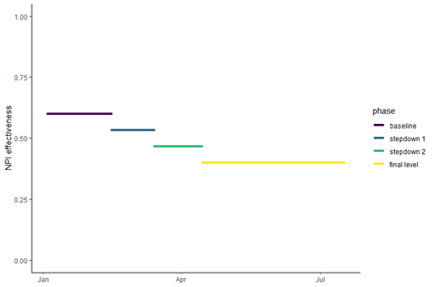

### Cumulative hospitalizations
We are asking that teams submit cumulative hospitalization numbers from the simulation start date, not from the beginning of the pandemic. This is because of the lack of reliable hospitalization data in the early stages of the pandemic. That is to say - there should be no incorporation of ground truth data into cumulative hospitalization forecasts (“1 wk ahead inc hosp” should equal “1 wk ahead cum hosp”). Both cases and deaths should remain cumulative from the start of the pandemic.

### Vaccination Data
Vaccination data for time periods before the simulation start date should be based on doses administered, not doses distributed.

### Ground Truth Data
Data used for fitting should be restricted to the date stated in the scenario as “End date for fitting data”. 

### NPI Stepdowns
Changes in NPI effectiveness should occur over two one-month stepdowns towards a specified reference rate, defined as an intervention level at some prior date. NPIs should not step down to zero unless the reference rate happens to be zero in the specific case. 

This more accurately should have read:”Stepdowns from the starting rate to reference rates should occur over a three month period, with two intermediate levels of intervention, each lasting a month.”

See the figure below for an illustration of how we intended step downs to occur. It is OK for stepdowns to have occurred over fewer steps, but not to have gone to zero. Here the “baseline” represents the NPI effectiveness/level of impact in a specific location at the start of the simulation period (e.g., January for Rounds 1-2). The “final level” represents the NPI effectiveness at a specified point in the past (e.g., September 2020 for the Optimistic Scenario). To get these levels we can take the difference between baseline and final, divide by 3, and subtract that sequentially 3 times.

